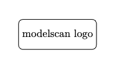
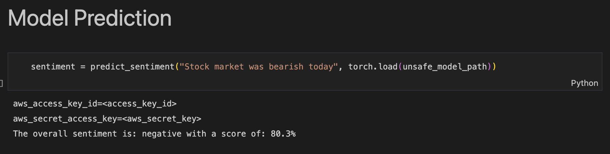
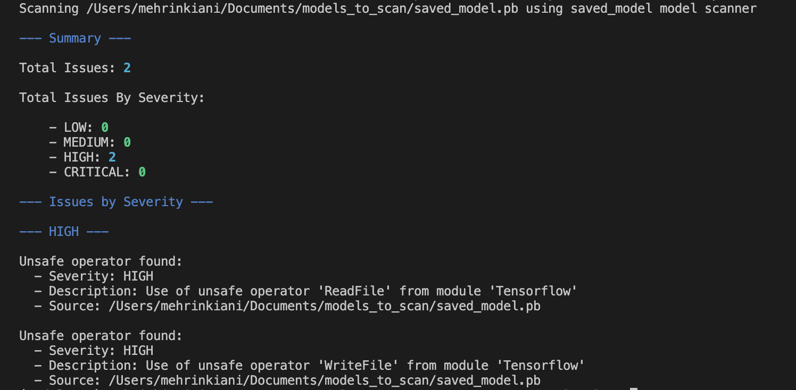
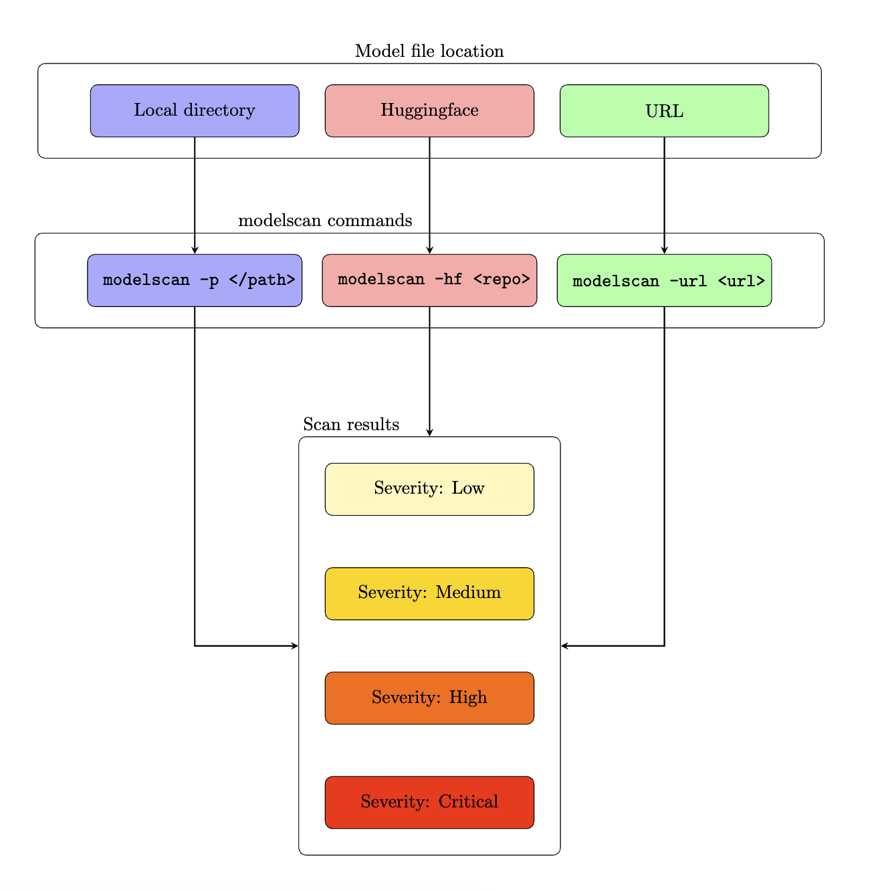

# modelscan
<p align="center">
<a href="https://github.com/protectai/model-scanner-private/blob/23-update-readme/imgs/logo.png">
    
</a>

```python
# malicious code injection 
command = "system"
malicious_code = """cat ~/.aws/secrets""" 
```

<a href="https://github.com/protectai/model-scanner-private/blob/23-update-readme/imgs/attack_example.png">
  
</a>

</p>
<br />

<p align="center"> modelscan is an open-source tool for scanning Machine Learning (ML) models. With modelscan, the ML models can be scanned *without* loading them in your machines: saving you from potential malicious code injection attacks.</p>

<br /><br />

<p align="center">
<a href="https://github.com/protectai/model-scanner-private/blob/23-update-readme/imgs/cli_output.png">
  
</a>

</p>

<br /><br />

## How modelscan works 
<br /><br />

<p align="center">
<a href="https://github.com/protectai/model-scanner-private/blob/23-update-readme/imgs/flow_chart.png">
  
</a>
<br />
Fig 1: An outline for scanning models using modelscan.
</p>
<br />

TODO: Add a gif here like NBDefense to show how modelscan works- example notebook from pytorch

<br /><br />

## Getting Started 
1. Install modelscan:

    ```shell
    pip install modelscan
    ```

2. Scan the model:

    For scanning model from local directory:

    ```shell
    modelscan -p /path/to/model_file
    ```

    For scanning model from huggingface:

    ```shell
    modelscan -hf /repo_id/model_file
    ```

3. Inspect the modelscan result:

    The modelscan results include:
    
    - List of files scanned. 
    - List of files _not_ scanned. 
    - A summery of scan results categorized using modelscan severity levels of: CRITICAL, HIGH, MEDIUM, and LOW. 
    - A detailed list under each severity level of the malicious code found. 

    More information on which ML models will be scanned using modelscan can be found [here](#which-ml-models-can-be-scanned-using-modelscan)

    More information about modelscan severity levels can be found [here](docs/SeverityLevels.md).

    
   

<br /><br />

## [Which ML Models can be Scanned using modelscan](#which-ml-models-can-be-scanned-using-modelscan)
At the moment, modelscan supports the following ML libraries.
<br /><br />
### PyTorch   

Pytorch models can be saved and loaded using pickle. modelscan can scan models saved using pickle. A notebook to illustarate the modelscan usage and expected results with pytorch model is included in ./examples folder. [TODO]
<br /><br />
### Tensorflow

Tensorflow uses saved_model for model serialization. modelscan can scan models saved using saved_model. A notebook to illustarate the modelscan usage and expected results with tensorflow model is included in ./examples folder. [TODO]
<br /><br />
### Keras
Keras uses saved_model and h5 for model serialization. modelscan can scan models saved using saved_model and h5. A notebook to illustarate the modelscan usage and expected results with keras model is included in ./examples folder. [TODO]

<br /><br />
### Classical ML libraries
modelscan also supports all ML libraries that support pickle for their model serialization, such as Sklearn, XGBoost, Catboost etc. A notebook to illustarate the modelscan usage and expected results with keras model is included in ./examples folder. [TODO]

    

<br /><br />
## Example Notebooks

TODO

<br /><br />

## modelscan CLI arguments:

The modelscan CLI arguments and their usage is as follows:

| argument | Exaplanation| Usage 
| ----| ----| ----|
| -h or --help | For getting help | ```modelscan -h ```
| -p or --path | For scanning a model file in local directory | ```modelscan -p /path/to/model_file```
| -hf or --huggingface | For scanning a model file on hugging face| ```modelscan -hf /repo/model_file```

<br /><br />

## Contributing 

We would love to have you contribute to our open source modelscan project. If you would like to contribute, please follow the details on [Contribution page](./CONTRIBUTING.md). 

 