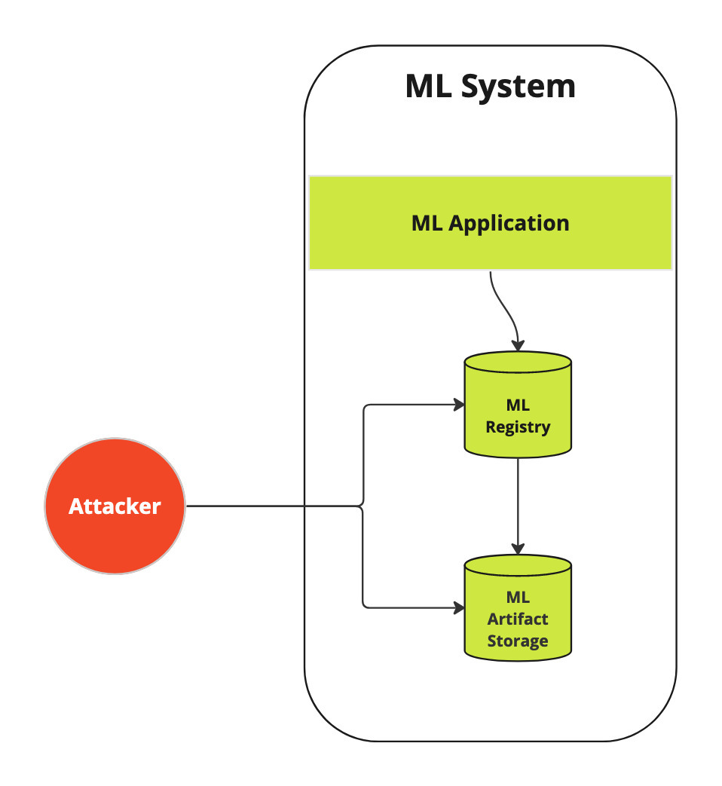
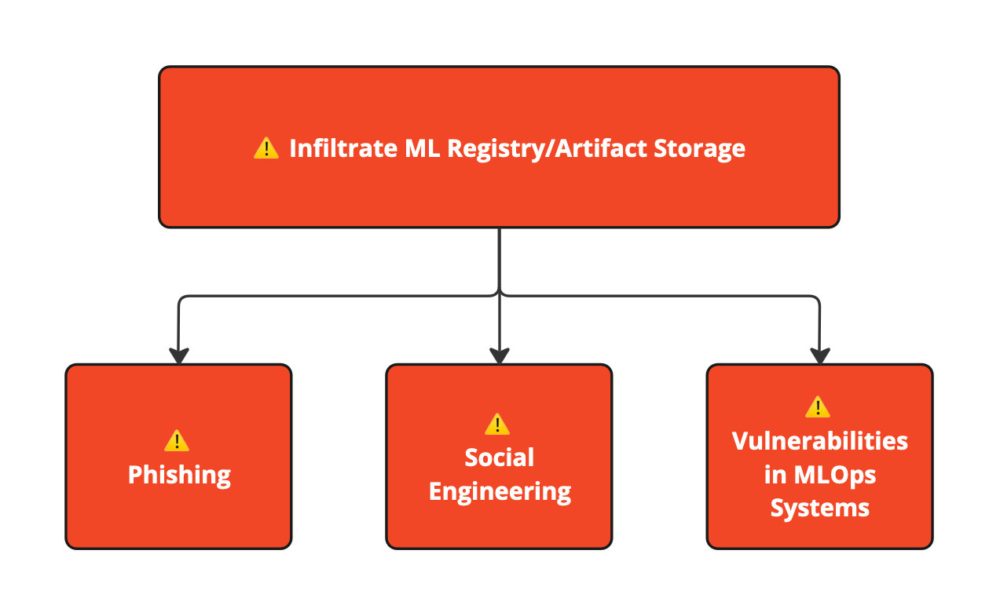

# Model Serialization Attacks

Machine Learning(ML) models are the foundational asset in ML powered applications. The ability to store and retrieve models securely is critical for success. Depending on the ML library in use there are a number of common formats in which a model can be saved. Popular choices are: Pickle, HDF5/H5 (Hierarchical Data Format), TensorFlow SavedModel, Model Checkpoints, and ONNX (Open Neural Network Exchange). Many of these formats allow for code to be stored alongside the model and create an often overlooked threat vector.

Models can be compromised in various ways, some are new like adversarial machine learning methods, others are common with traditional applications like denial of service attacks. While these can be a threat to safely operating an ML powered application, this document focuses on exposing the risk of Model Serialization Attacks.
In a Model Serialization Attack malicious code is added to a model when it is saved, this is also called a code injection attack as well. When any user or system then loads the model for further training or inference the attack code is executed immediately, often with no visible change in behavior to users. This makes the attack a powerful vector and an easy point of entry for attacking broader machine learning components.

To secure ML models, you need to understand what’s inside them and how they are stored on disk in a process called serialization. 

ML models are composed of:

1. **Vectors** **— core data structure**
    1. NumPy arrays — Primarily used with classic ML frameworks (Scikit-learn, XGBoost, ..)
    2. Tensors (TensorFlow Tensor, PyTorch Tensor, ..)  
    Popular DNN  frameworks like TensorFlow and Pytorch have implemented their own Tensor libraries that enable performant operations during training and inference. Typically DNN model weights and biases can be stored separately from the DNN Model Architecture (Computation and Transformations).
2. **Computation and Transformations**
    1. Classic ML algorithms
        1. Regression
        2. Classification
        3. Clustering and more
    2. Deep Neural Network(DNN) layers
        1. CNN based
        2. RNN based
        3. Transformers based and more
    3. Vector/Tensor transformations

Before digging into how a Model Serialization Attack works and how to scan for them, first you should learn a few approaches to saving models, and the security implications of each option.

# Approaches for Storing ML Models & Security Implications

## 1. Pickle Variants

**Pickle** and its variants (cloudpickle, dill, joblib) all store objects to disk in a general purpose way. These frameworks are completely ML agnostic and store Python objects as-is. 

Pickle is the defacto library for serializing ML models for following ML frameworks:

1. Classic ML models (scikit-learn, XGBoost, ..)
2. PyTorch models (via built-in [torch.save](http://torch.save) API)

Pickle is also used to store vectors/tensors only for following frameworks:

1. Numpy via `numpy.save(.., allow_pickle=True, )`
2. PyTorch via `torch.save(model.state_dict(), ..)`

### Security Implications

Pickle allows for arbitrary code execution and is highly vulnerable to code injection attacks with very large attack surface. Pickle documentation makes it clear with the following warning:

> **Warning:** The `pickle` module **is not secure**. Only unpickle data you trust.
> 
> 
> It is possible to construct malicious pickle data which will **execute
> arbitrary code during unpickling**. Never unpickle data that could have come
> from an untrusted source, or that could have been tampered with.
> 
> Consider signing data with [hmac](https://docs.python.org/3/library/hmac.html#module-hmac) if you need to ensure that it has not
> been tampered with.
> 
> Safer serialization formats such as [json](https://docs.python.org/3/library/json.html#module-json) may be more appropriate if
> you are processing untrusted data.

Source: [https://docs.python.org/3/library/pickle.html](https://docs.python.org/3/library/pickle.html)

## 2. TensorFlow SavedModel

TensorFlow is one of the few ML frameworks to implement its own storage format, SavedModel format, basing it on the Protocol Buffer format.

### Security Implications

This is generally a secure approach as majority of TensorFlow operations are just ML computations and transformations. However, exceptions exist that can be exploited for model serialization attacks:

- `io.write_file`
- `io.read_file`
- `io.MatchingFiles`
- Custom Operators — allow arbitrary code to be executed but these operators need to be explicitly loaded during Inference as a library which makes it hard to carry out a model serialization attack however these can be potent in a supply chain attack. So it is still important to treat TensorFlow models with custom operators to high degree of scrutiny.

## 3. H5 (Keras)

Keras is one of the few ML frameworks to natively offer model serialization to the HDF5 format. HDF5 is a general format for data serialization popular in academia and research. Keras offers two flavors of HDF5/H5py:

1. `tf.keras.Model.save` with `save_format='h5'` or passing a filename that ends in `.h5`
2. New Keras v3 format — recommended since TensorFlow version v2.13.0  
Passing `save_format='tf'` to `save()` or passing a filename without an extension

### Security Implications

This is generally a secure format with the exception of Keras Lambda layer operation. Lambda Layer operation allows for arbitrary code execution (meant for data pre/post processing before it gets passed to ML model) and hence opens up large attack surface.

## 4. Inference Only

The frameworks in this category all implement their own internal ML Computational Graph with built-in operators. These operators do not perform disk or network I/O and hence have very small attack vector (if any). They strictly focus on ML computation and transformation.

### Security Implications

These operators are restricted to ML computations and transformations and hence have small attack surface. Similar to the above category though, supply chain attacks can be carried out with Custom Operators, so treat any usage of that feature with a high degree of scrutiny.

1. ONNX
2. TensorRT
3. Apache TVM

## 5. Vector/Tensor Only

Typically used for sharing DNN model weights only, without DNN architecture (computations and transformations). Some of the general purpose serialization frameworks used are:

1. JSON
2. MsgPack
3. Apache Arrow
4. FlatBuffers

Following are special purpose serialization formats for storing vector/tensor (including but not limited to model weights and biases):

1. Safetensors
2. NPY/NPZ (NumPy’s own binary file format)

### Security Implication

With the exception of pickle, these formats cannot execute arbitrary code. However, an attacker can modify weights and biases to tweak or influence the ML model differently resulting in security risk. Meaningful manipulation of model weights and biases to perform a poisoning attack is non-trivial but possible.

## Summary

| Approach | Popularity | Risk of Model Serialization Attack Exploitability |
| --- | --- | --- |
| Pickle Variants | Very high | Very high |
| Tensorflow SavedModel | High | Medium |
| H5 (Keras) | High | Low (except Keras Lambda layer) |
| Inference Only | Medium | Low |
| Vector/Tensor Only | Low | Very low |

With an understanding of various approaches to model serialization, explore how many popular choices are vulnerable to this attack with an end to end explanation.

# End to end Attack Scenario
1. Internal attacker:
The attack complexity will vary depending on the access trusted to an internal actor.
2. External attacker:
External attackers usually have to start from scratch unless they have infiltrated already and are trying to perform privilege escalation attacks.

### Step 1: Find where ML models are stored

In either case, the attacker will typically start with the system that stores ML models at rest. This is typically a specialized Model Registry or a generic artifact storage system.

OSS examples:

- [MLflow](https://mlflow.org/) (check out Protect AI’s [blog post series](https://protectai.com/blog/tag/mlflow) uncovering critical vulnerabilities in MLflow model artifact storage system)
- [Kubeflow](https://www.kubeflow.org/docs/external-add-ons/kserve/webapp/)
- [Aim](https://github.com/aimhubio/aim)

Commercial examples:

- [Amazon Sagemaker](https://docs.aws.amazon.com/sagemaker/latest/dg/model-registry.html)
- [Azure ML](https://learn.microsoft.com/en-us/azure/machine-learning/how-to-manage-models)
- [Google Cloud Vertex AI](https://cloud.google.com/vertex-ai/docs/model-registry/introduction)
- [Oracle Cloud Data Science](https://docs.oracle.com/en-us/iaas/data-science/using/models-about.htm)

### Step 2: Infiltrate Model Registry

There are many ways to carry out infiltration. Phishing and social engineering are very widely employed techniques for gaining access. Another technique would be to look for unpatched instances of an OSS Model Registry like MLflow (see [Protect AI blog post series](https://protectai.com/blog/tag/mlflow) for more).

### Step 3: Inject Malicious Code into ML models

This is the easiest step of all. See [ModelScan Notebook Examples](https://github.com/protectai/modelscan/tree/main/notebooks) for details (working Notebooks and code samples) on how this attack can be carried out. For certain serialized model formats like pickle, an attacker can inject abitrary code that executes. This pushes the attack surface wide open to all kinds of attacks including few included below.

With how easy it is to compromise a model, it is important to know how to securely serialize models to mitigate this threat as much as possible.

# How to Securely Serialize Models

Avoid use of pickle (and its variants). It is by far the most insecure format for serializing models. Below we have recommendations (more to come soon):

| ML Framework | Secure Serialization | Details | Pros | Cons |
| --- | --- | --- | --- | --- |
| **PyTorch** | ONNX | Export model to ONNX [via torch.onnx.export method](https://pytorch.org/tutorials/advanced/super_resolution_with_onnxruntime.html).   Avoid PyTorch’s torch.save functionality as it is not secure. | ONNX is a secure format. It does not allow for arbitrary code execution.  ONNX is significantly faster than raw PyTorch for Inference. | ONNX is not just a serialization format. The model undergoes conversion from a PyTorch to an ONNX model. ONNX maps PyTorch tensors and ML graph (computation) into its own. |
| **TensorFlow** | SavedModel | TensorFlow native serialization format based on Protocol Buffers. | Native format. Easy to use. Fairly secure. | Handful or TF operations allow disk I/O that can be exploited.   ModelScan will look for these and generate finding. |
| **Keras** | HDF5 or Keras v3 | TensorFlow native serialization format based on HDF5/H5. | Native format. Easy to use. Fairly secure. | Avoid lambda layer. It is not secure. Instead share pre/processing code between training and inference code.  ModelScan will look for lambda layer and generate finding. |

# How to Secure ML Models

Defense in Depth and Zero Trust are critical strategies for modern software security.  We recommend following measures:

1. Only store ML models in a system with **authenticated access**.
For instance MLflow (a very popular model OSS model registry) does not offer any authenticaion out of the box. Unfortunately, there are many public instances of MLflow on the Internet that did not place an authentication gateway in front of ML flow. The proprietary models on these instances are publicly accessible!
2. Implement fine grained least privilege access via **Authorization** or **IAM** (identity and Access Management) systems.
3. Use a scanning tool like **ModelScan** — this will catch any code injection attempts.
    1. Scan all models before they are used(retraining, fine tuning, evaluation, or inference) at any and all points in your ML ecosystem.
4. **Encrypt models at rest** (eg. S3 bucket encryption) — this will reduce chances of an adversary (external or even internal) reading and writing models after a successful infiltration attempt.
5. **Encrypt models at transit** — always use TLS or mTLS for all HTTP/TCP connections including when models are loaded over the network including internal networks. This protects against MITM (man in the middle) attacks.
6. For your own models, **store checksum** and always **verify checksum** when loading models. This ensures integrity of the model file(s).
7. **Cryptographic signature** — this ensures both integrity and authenticity of the model.
